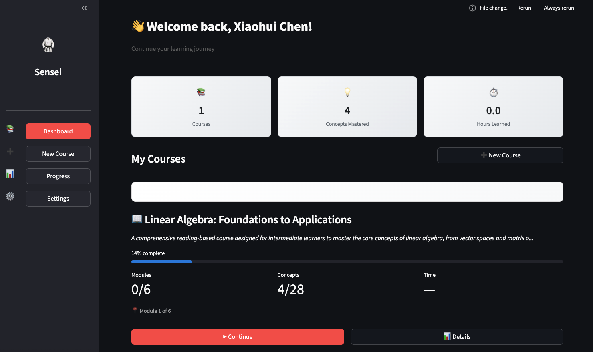
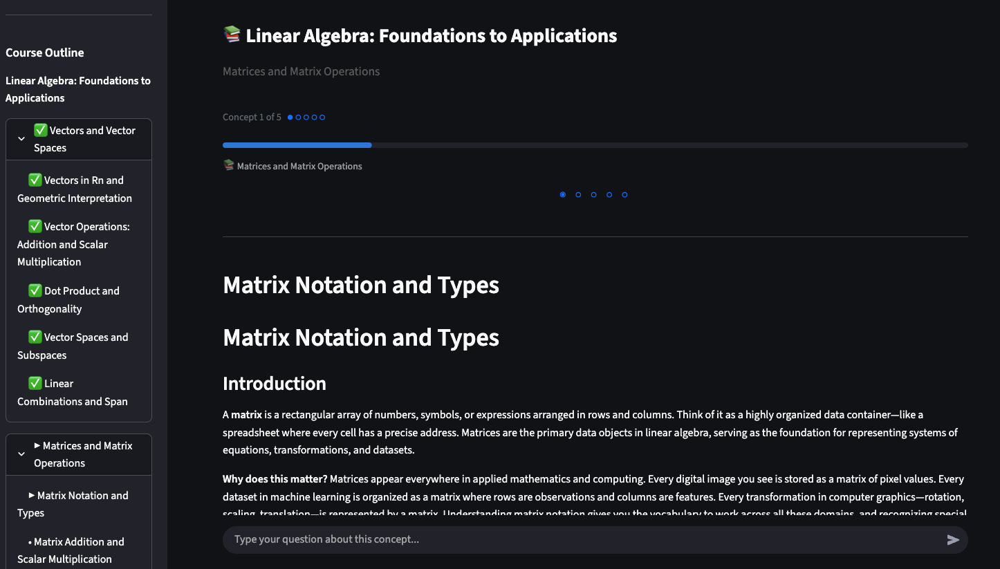
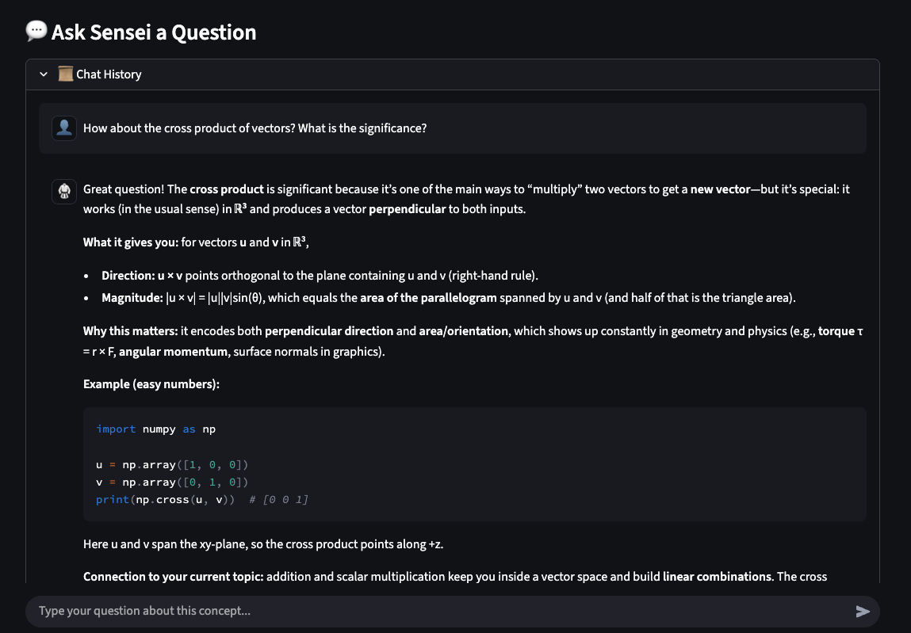
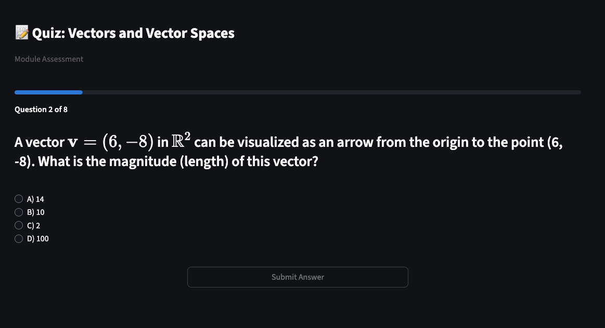
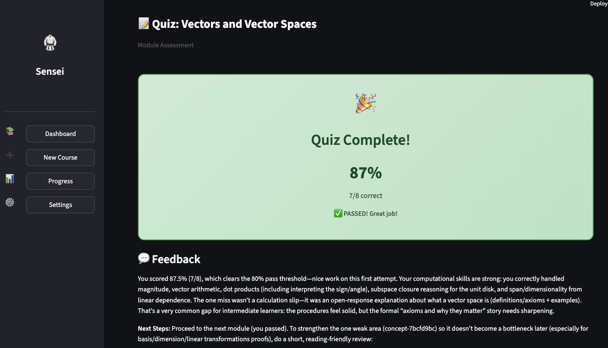

# 🥋 Sensei

**Your AI-Powered Adaptive Learning Tutor**

> *"先生" (Sensei) — Teacher, Master, One Who Has Gone Before*

Sensei is an intelligent tutoring system that creates personalized learning experiences using CrewAI's multi-agent framework. Simply tell Sensei what you want to learn, and it will generate a structured curriculum, teach you concepts interactively, answer your questions, and assess your understanding through adaptive quizzes.



---

## ✨ Features

### 📚 Custom Curriculum Generation
Tell Sensei any topic you want to learn—from "Linear Algebra" to "CUDA Programming"—and watch as AI agents collaborate to create a structured, progressive curriculum tailored to your experience level and learning style.

### 🎓 Interactive Lessons
Learn concepts through AI-generated lessons that include clear explanations, practical code examples, and key takeaways. The content adapts to your preferred learning style (visual, reading, or hands-on).



### 💬 Ask Sensei Anything
Have a question about what you're learning? Ask Sensei anytime! The Q&A mentor provides contextual answers with examples and connects concepts to your current lesson.



### 📝 Adaptive Quizzes
Test your knowledge with AI-generated assessments. Questions are tailored to the concepts you've learned, and the system identifies areas that need more practice.



### 📊 Intelligent Feedback
After each quiz, receive detailed feedback analyzing your performance, highlighting strengths, identifying weak areas, and providing personalized next steps for improvement.



### 📈 Progress Tracking
Monitor your learning journey across all courses with visual progress indicators, quiz history, and learning statistics.

---

## 🏗️ Architecture

Sensei leverages **CrewAI's multi-agent framework** to orchestrate specialized AI agents that work together to deliver a comprehensive learning experience.

### Multi-Agent Crews

```
┌─────────────────────────────────────────────────────────────────────────┐
│                           SENSEI ARCHITECTURE                           │
├─────────────────────────────────────────────────────────────────────────┤
│                                                                         │
│  ┌─────────────────────────────────────────────────────────────────┐   │
│  │                     CURRICULUM CREW (Flow)                       │   │
│  │  ┌─────────────────────┐    ┌─────────────────────┐             │   │
│  │  │ Curriculum Architect│───▶│  Content Researcher │             │   │
│  │  │  (Claude Opus 4.5)  │    │   (Gemini 3 Pro)    │             │   │
│  │  └─────────────────────┘    └─────────────────────┘             │   │
│  │  Plans course structure      Expands modules in parallel         │   │
│  └─────────────────────────────────────────────────────────────────┘   │
│                                    │                                    │
│                                    ▼                                    │
│  ┌─────────────────────────────────────────────────────────────────┐   │
│  │                     TEACHING CREW (Dynamic)                      │   │
│  │  ┌─────────────────────┐    ┌─────────────────────┐             │   │
│  │  │  Knowledge Teacher  │    │      Q&A Mentor     │             │   │
│  │  │  (Claude Opus 4.5)  │    │     (GPT 5.2)       │             │   │
│  │  └─────────────────────┘    └─────────────────────┘             │   │
│  │  Generates lessons           Answers questions                   │   │
│  └─────────────────────────────────────────────────────────────────┘   │
│                                    │                                    │
│                                    ▼                                    │
│  ┌─────────────────────────────────────────────────────────────────┐   │
│  │                    ASSESSMENT CREW (Sequential)                  │   │
│  │  ┌─────────────────────┐    ┌─────────────────────┐             │   │
│  │  │    Quiz Designer    │───▶│ Performance Analyst │             │   │
│  │  │  (Claude Opus 4.5)  │    │     (GPT 5.2)       │             │   │
│  │  └─────────────────────┘    └─────────────────────┘             │   │
│  │  Creates quiz questions      Evaluates & provides feedback       │   │
│  └─────────────────────────────────────────────────────────────────┘   │
│                                                                         │
└─────────────────────────────────────────────────────────────────────────┘
```

### Why Multi-Agent?

| Benefit | Description |
|---------|-------------|
| **Specialization** | Each agent is an expert in its domain (curriculum design, teaching, assessment) |
| **Parallelization** | Multiple agents can work simultaneously (e.g., expanding modules in parallel) |
| **Quality** | Different LLMs excel at different tasks—we use the best model for each role |
| **Maintainability** | Clean separation of concerns makes the system easier to extend and debug |

### Technology Stack

- **Framework**: [CrewAI](https://www.crewai.com/) for multi-agent orchestration
- **Frontend**: [Streamlit](https://streamlit.io/) for the interactive UI
- **LLMs**: Claude Opus 4.5, GPT 5.2, Gemini 3 Pro (via LiteLLM)
- **Data**: SQLite for progress tracking, JSON for course storage
- **Validation**: Pydantic for data models and schema validation

---

## 🚀 Project Status

| Milestone | Description | Status |
|-----------|-------------|--------|
| M1 | Project Foundation | ✅ Complete |
| M2 | Storage Layer | ✅ Complete |
| M3 | Data Models & Schemas | ✅ Complete |
| M4 | Service Layer (No AI) | ✅ Complete |
| M5 | CrewAI Crews | ✅ Complete |
| M6 | Service-Crew Integration | ✅ Complete |
| M7 | UI Components | ✅ Complete |
| M8 | UI Pages | ✅ Complete |
| M9 | Core App & Documentation | ✅ Complete |
| M10 | End-to-End Integration & Polish | ⏳ In Progress |

---

## 🛠️ Installation

### Prerequisites

- Python 3.11+
- [uv](https://docs.astral.sh/uv/) package manager
- API keys for OpenAI, Anthropic, and Google AI

### Quick Start

```bash
# Navigate to the project directory
cd 3-crew-ai/sensei

# Install dependencies
uv sync

# Copy environment variables template
cp ../../.env.example .env
```

### Configure API Keys

Edit your `.env` file with the required API keys:

```bash
# Required for Sensei
OPENAI_API_KEY=your-openai-key        # Q&A Mentor, Performance Analyst
ANTHROPIC_API_KEY=your-anthropic-key  # Content Researcher, Knowledge Teacher, Quiz Designer
GOOGLE_API_KEY=your-google-key        # Curriculum Architect

# Optional: LangSmith tracing for debugging
LANGSMITH_TRACING=true
LANGSMITH_API_KEY=your-langsmith-key
LANGSMITH_PROJECT=project-sensei
```

### Run Sensei

```bash
uv run streamlit run src/sensei/app.py
```

The app will open in your browser at `http://localhost:8501`.

---

## 📖 Usage Guide

### 1. First-Time Setup (Onboarding)

When you first launch Sensei, you'll be guided through a quick onboarding process:

1. **Enter your name** — Sensei will personalize your experience
2. **Choose your learning style** — Visual, Reading, or Hands-on
3. **Set session length** — How long you prefer to study
4. **Select experience level** — Beginner, Intermediate, or Advanced
5. **Define your goals** — What you want to achieve

### 2. Create a New Course

1. Click **"New Course"** in the sidebar
2. Enter any topic you want to learn (e.g., "Linear Algebra", "Machine Learning", "Rust Programming")
3. Click **"Generate Course"** and wait while the Curriculum Crew creates your personalized curriculum
4. Review the generated course outline
5. Click **"Start Learning"** to begin

### 3. Learn Concepts

- Navigate through concepts using the **Previous/Next** buttons
- Read through AI-generated lessons with explanations and code examples
- Track your progress with the module progress bar
- Click on concepts in the sidebar to jump to specific topics

### 4. Ask Questions

- Use the chat input at the bottom of the learning page
- Type any question about the current concept
- Sensei's Q&A Mentor will provide contextual answers with examples
- Your chat history is preserved throughout the session

### 5. Take Quizzes

- Complete all concepts in a module to unlock the quiz
- Answer multiple-choice and open-ended questions
- Submit your answers to receive immediate feedback
- Pass with 80% or higher to proceed to the next module
- Review weak areas if you need more practice

### 6. Track Progress

- Visit the **Progress** page to see your learning statistics
- View completion percentages for each course
- Review your quiz history and scores
- Identify concepts that need more attention

---

## 🧪 Testing

### Run Unit Tests (Default)

By default, pytest runs **only unit tests** (functional and e2e tests are excluded):

```bash
uv run pytest
```

### Run with Coverage Report

```bash
uv run pytest --cov=sensei --cov-report=term-missing
```

### Run Specific Test Suites

```bash
# Service layer tests
uv run pytest tests/test_services/

# Crew unit tests (mocked LLM)
uv run pytest tests/test_crews/

# Storage layer tests
uv run pytest tests/test_storage/

# Model/Schema tests
uv run pytest tests/test_models/

# UI component tests
uv run pytest tests/test_ui/
```

### Run Functional Tests (Real LLM Calls)

> ⚠️ **Note**: Functional tests make actual API calls and incur costs. Ensure all three API keys are configured.

```bash
# Run all functional tests
uv run pytest tests/test_functional/ -v -s

# Run specific crew functional tests
uv run pytest tests/test_functional/test_curriculum_crew_functional.py -v -s
uv run pytest tests/test_functional/test_teaching_crew_functional.py -v -s
uv run pytest tests/test_functional/test_assessment_crew_functional.py -v -s
```

### Test Coverage

| Layer | Coverage |
|-------|----------|
| Models | ~100% |
| Storage | ~95% |
| Services | ~94% |
| Crews | ~90% |
| **Overall** | **~94%** |

---

## 🔧 Troubleshooting

### Common Issues

#### "Missing API Key" Error

**Problem**: The app shows an error about missing API keys.

**Solution**: Ensure all three API keys are set in your `.env` file:
```bash
OPENAI_API_KEY=sk-...
ANTHROPIC_API_KEY=sk-ant-...
GOOGLE_API_KEY=AI...
```

#### Course Generation Takes Too Long

**Problem**: Creating a new course is slow or times out.

**Solution**: 
- Course generation involves multiple LLM calls and typically takes 30-60 seconds
- Check your network connection
- Verify your API keys have sufficient quota
- For complex topics, generation may take longer

#### "Rate Limit Exceeded" Error

**Problem**: You see rate limit errors from the LLM providers.

**Solution**:
- Wait a few minutes before retrying
- Sensei includes automatic retry with exponential backoff
- Consider upgrading your API tier for higher limits

#### Quiz Questions Not Loading

**Problem**: Quiz page shows loading spinner indefinitely.

**Solution**:
- Ensure you've completed all concepts in the module
- Check browser console for errors
- Try refreshing the page
- Verify your API keys are valid

#### Data Not Persisting

**Problem**: Your courses or progress disappear after restart.

**Solution**:
- Ensure the `data/` directory exists and is writable
- Check that `data/sensei.db` is not corrupted
- Course files are stored in `data/courses/`

### Debug Mode

Enable verbose logging by setting the environment variable:

```bash
export CREWAI_VERBOSE=true
uv run streamlit run src/sensei/app.py
```

For detailed LLM tracing, enable LangSmith:

```bash
LANGSMITH_TRACING=true
LANGSMITH_API_KEY=your-key
LANGSMITH_PROJECT=sensei-debug
```

---

## 📁 Project Structure

```
sensei/
├── src/sensei/
│   ├── app.py              # Main Streamlit application
│   ├── crews/              # CrewAI crew implementations
│   │   ├── curriculum_crew/
│   │   ├── teaching_crew/
│   │   └── assessment_crew/
│   ├── models/             # Pydantic data models
│   ├── services/           # Business logic layer
│   ├── storage/            # Data persistence
│   ├── ui/                 # Streamlit components & pages
│   └── utils/              # Utility functions
├── tests/                  # Test suites
├── data/                   # Runtime data (gitignored)
└── docs/                   # Documentation & screenshots
```

---

## 📚 Documentation

- [`BACKEND_DESIGN.md`](./docs/BACKEND_DESIGN.md) — Backend architecture and service design
- [`FRONTEND_DESIGN.md`](./docs/FRONTEND_DESIGN.md) — UI components and page layouts
- [`PROPOSED_FILE_ARCHITECTURE.md`](./docs/PROPOSED_FILE_ARCHITECTURE.md) — Complete file structure
- [`PLANNING.md`](./docs/PLANNING.md) — Implementation milestones and task breakdown

---

## 🙏 Acknowledgments

Built with:
- [CrewAI](https://www.crewai.com/) — Multi-agent AI framework
- [Streamlit](https://streamlit.io/) — Python web app framework
- [LiteLLM](https://github.com/BerriAI/litellm) — Universal LLM interface

---

*"The teacher who is indeed wise does not bid you to enter the house of his wisdom but rather leads you to the threshold of your mind." — Kahlil Gibran*
